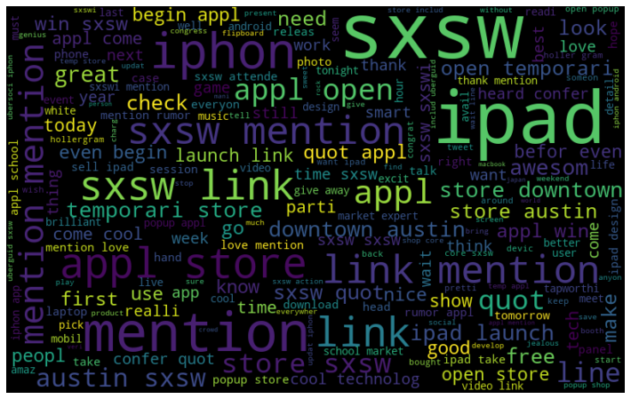
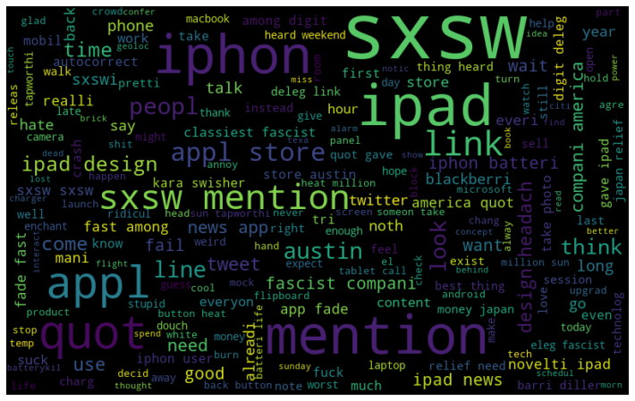
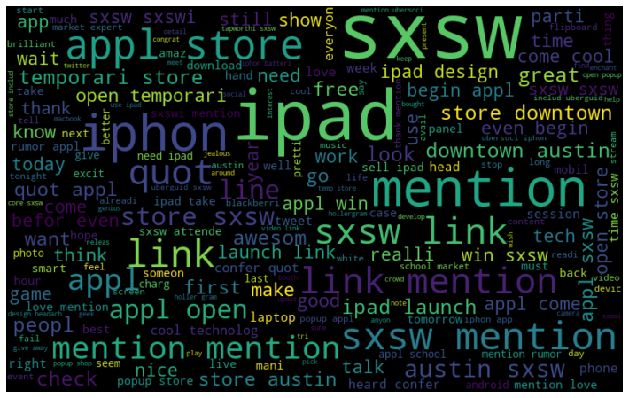

# Whats Eating Apple's Customers

## Background
Customers buy Apple products everyday.They also hop on twitter to voice their opinions about products everyday on Twittter. Using Natural Language Processing (NLP), we can determine what are the most common words being sent and with what tone. And Identify the best model for future predictions.

## Business Problem
What positive things are customers saying about Apple Products or Apple Company?

What negative things are customers saying about Apple Products or Apple Company?

## Data
Using the tweet product dataset. Dataset has over 9000 tweets, and 3 columns.
Contains data including 
• Tweets
• Focus of the tweet 
• Sentiment

## Methods
Removal of special characters (@,#, etc.)

Applying NLP Techniques such as Stemming, Lemmatization, and Tokenization.

Removal of small words (less than 3 characters in length)

Removing stop words

Build machine learning models with Word Vectorizers to predict future sentiments (using CountVectorizer and Term Frequency - Inverse Document Frequency (TFIDF)

Developed several models to evaluate performance
• Precision – correct predictions vs total predictions
• Recall – Correct predictions vs actual positive predictions
• F1 score – harmonic mean of Precision and Recall • Accuracy

## Results
WordCloud for positive Emotion Sentiment

WordCloud for Negative Emotion Sentiment

WordCloud for all Apple Sentiments

## Conclusions / Summary of Findings
Most positive words were associated with events.

Most negative words associated with the product or negative words (such as battery)

The TFIDF Vectorizer is the best for predicting future sentiments.
• TFIDF Vectorizer outperformed Precision, Recall, F1 score against CountVectorizer

├── data : data used for modeling

├── images : images used in PPT and readme

├── README.md : project information and repository structure

├── dsc-phase-4-project-presentation.pptx : (Presentation for Stakeholders)

└── dsc-phase-4-project.ipynb (jupyter notebook used for modeling)

