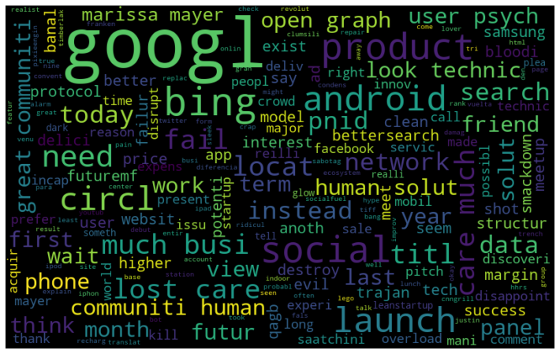

# Whats Eating Apple's Customers

## Background
A new iPhone and Android has just been released.

Attendees are voicing their oppinions on Twitter

Using Natural Language Processing (NLP) we can determine what are the most common words being used and what tone

Identify the best model for future predictions

## Business Problem
We are marketing company contracted to evaluate these customers tweets based on sentiments

Identify what customers are saying about the new phones and company.

## Data
Using the tweet product dataset. Dataset has over 9000 tweets, and 3 columns.
Contains data including 
• Tweets
• Focus of the tweet 
• Sentiment

## Methods
Removal of special characters (@,#, etc.)

Applying NLP Techniques such as Stemming, Lemmatization, and Tokenization.

Removal of small words (less than 3 characters in length)

Removing stop words

Build WordClouds - Visualization of most common and important words.

Build machine learning models with Word Vectorizers to predict future sentiments (using CountVectorizer and Term Frequency - Inverse Document Frequency (TFIDF)

Developed several models to evaluate performance
• Precision – correct predictions vs total predictions
• Recall – Correct predictions vs actual positive predictions
• F1 score – harmonic mean of Precision and Recall • Accuracy

Count Vectorizer counts the number of times a word appears.

TFIDF (Term Frequency - Inverse Document Frequency counts the number of words but considers the overall document weightage

## Results
WordCloud for Apple positive Emotion Sentiment

Wordcloud for Google Positive Sentiment

WordCloud for Apple Negative Emotion Sentiment

WordCloud for Google Negative Emotion Sentiment

WordCloud for all Apple Sentiments

WordCloud for all Google Sentiments

## Conclusions / Summary of Findings
Most positive words were associated with events for Google and Apple

Most negative words associated with the product or negative words (such as battery) for Google

Most negative words were associated wityh the event for Google

The TFIDF Vectorizer is the best for predicting future sentiments.
• TFIDF Vectorizer outperformed Precision, Recall, F1 score against CountVectorizer

## Next Steps...

1) Perform Sentiment analysis at months then a year to see how much better or worse the product has improved

2) Based on the reviews, make improvements to product please customer.

3) Perform on other companies that make smart phones such as Nokia, Samsung, Huawei see how they are doing using Sentiment Analsysis..

├── data : data used for modeling

├── images : images used in PPT and readme

├── README.md : project information and repository structure

├── dsc-phase-4-project-presentation.pptx : (Presentation for Stakeholders)

└── dsc-phase-4-project.ipynb (jupyter notebook used for modeling)

